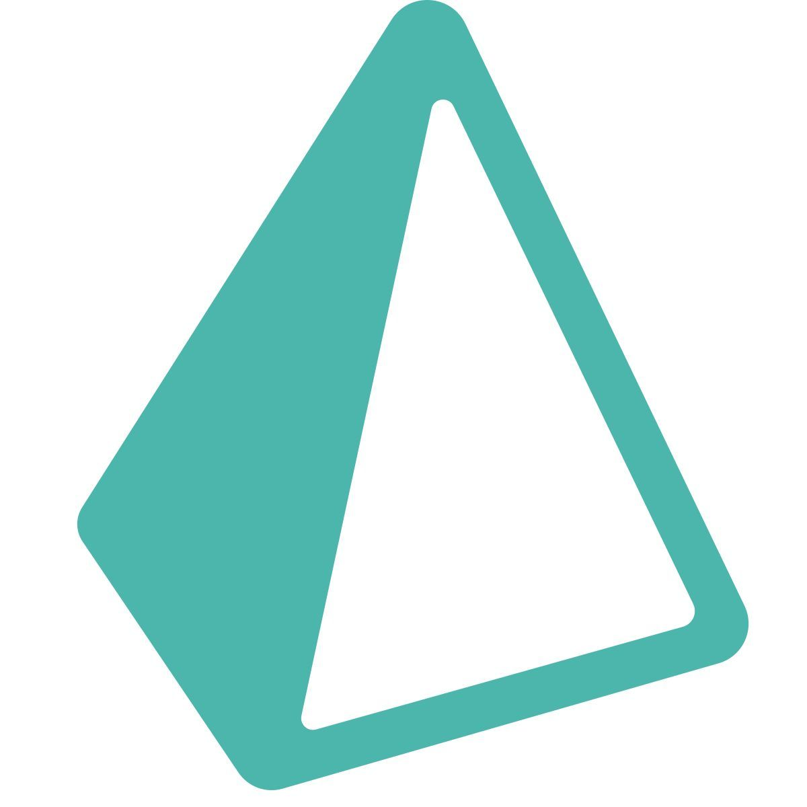
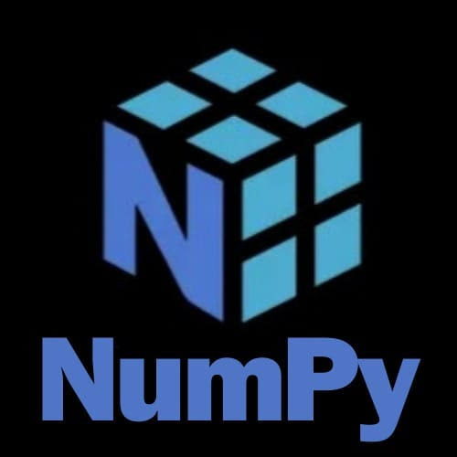
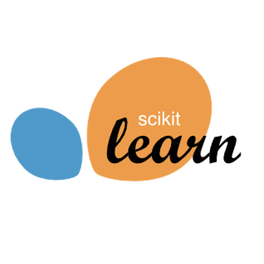
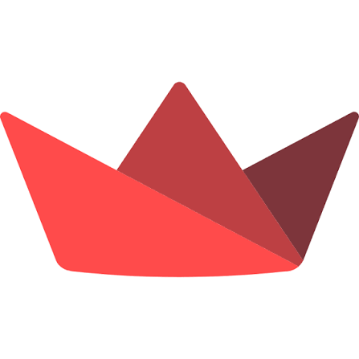
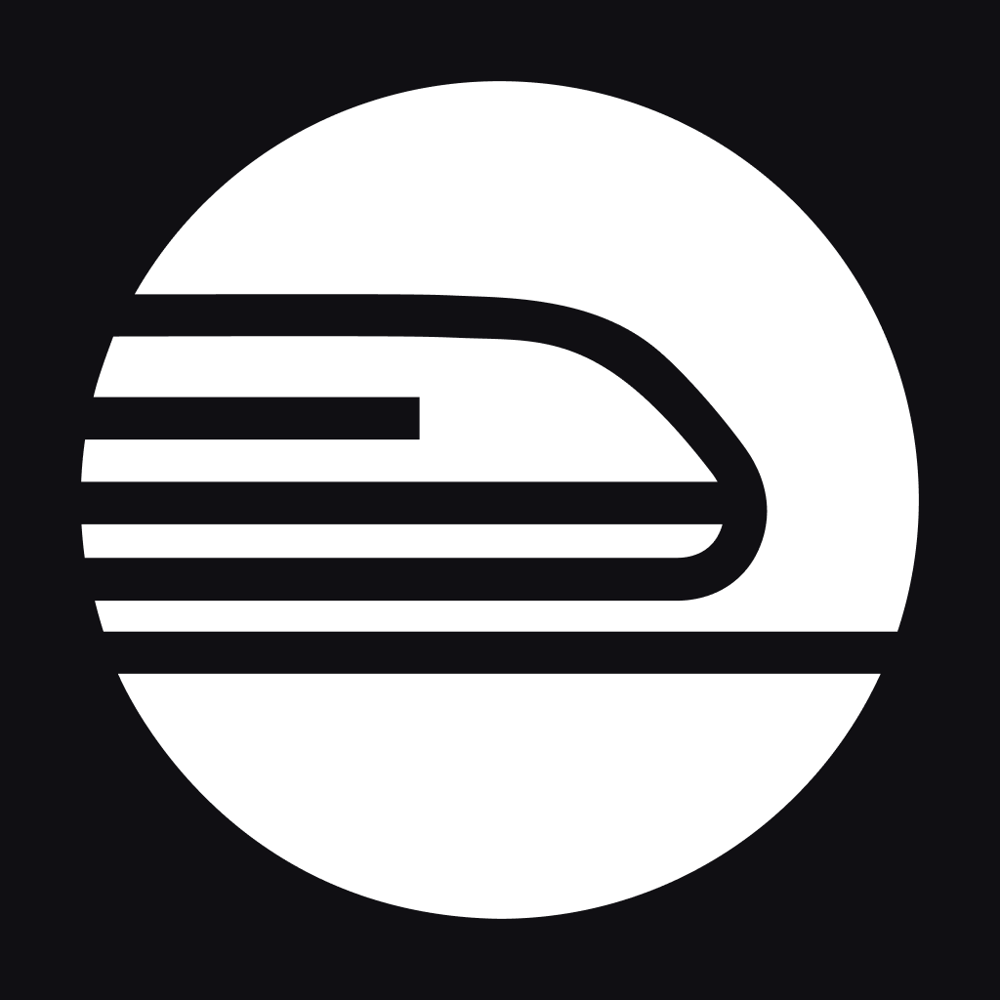

<div align="center">


</div>

<table width="100%" border="0" cellspacing="0" cellpadding="0">
<tr>
<td width="100%">

## `~/about`

```
Computer Science Engineering student focused on building
scalable, production-grade applications.

Interested in backend systems, full stack engineering,
system design, always learning modern
tools and continuously refining engineering craft.
```

</td>
</tr>
</table>

<br/>

## `~/tech-stack`

<table width="100%">
<tr>
<td valign="top" width="50%">

**Languages**


</td>
<td valign="top" width="50%">

**Frontend**


</td>
</tr>
<tr>
<td valign="top" width="50%">

**Backend**


</td>
<td valign="top" width="50%">

**Databases**





</td>
</tr>
<tr>
<td valign="top" width="50%">

**AI & Data**









</td>
<td valign="top" width="50%">

**Developer Tools**




</td>
</tr>
</table>

<br/>

## `~/analytics`

<div align="center">


<picture>
  <source media="(prefers-color-scheme: dark)" srcset="https://raw.githubusercontent.com/platane/snk/output/github-contribution-grid-snake-dark.svg" />
  
</picture>

</div>

<br/>

## `~/connect`

<div align="center">

[](https://github.com/rumanajaha)
[](https://linkedin.com/in/rumana-jaha-aa882b367)
[](mailto:rumanajaha1@gmail.com)

<br/>


</div>

<br/>

<div align="center">
<sub><i>Always down to learn and level up!</i></sub>
</div>

